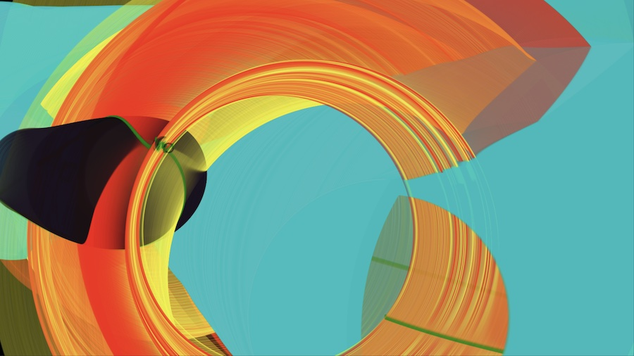

# Project Title

Orbits



## Description

Orbits is based on the artwork "Four" that was shown in the Whitney Artport in 2004. It uses a physics engine to simulate gravitational attraction between masses, and renders overlapping shapes from their positions.

## Getting Started

### Dependencies

Runs in a browser, written in Javascript, uses Canvas2D to render.

### Installing

Easiest way to install:
* Click the green 'Code' button in the upper right of the github.com repo page
* Choose 'Download ZIP'
* Unzip the downloaded file - it will create a folder called 'orbits-main'
* cd into that folder, start a local webserver (instructions below)
* open the localhost url in a browser

To run locally, start an http server, for example on Mac:
```
cd <your local path>/orbits
python3 -m http.server 8000
```
then open the web page in a browser http://localhost:8000
